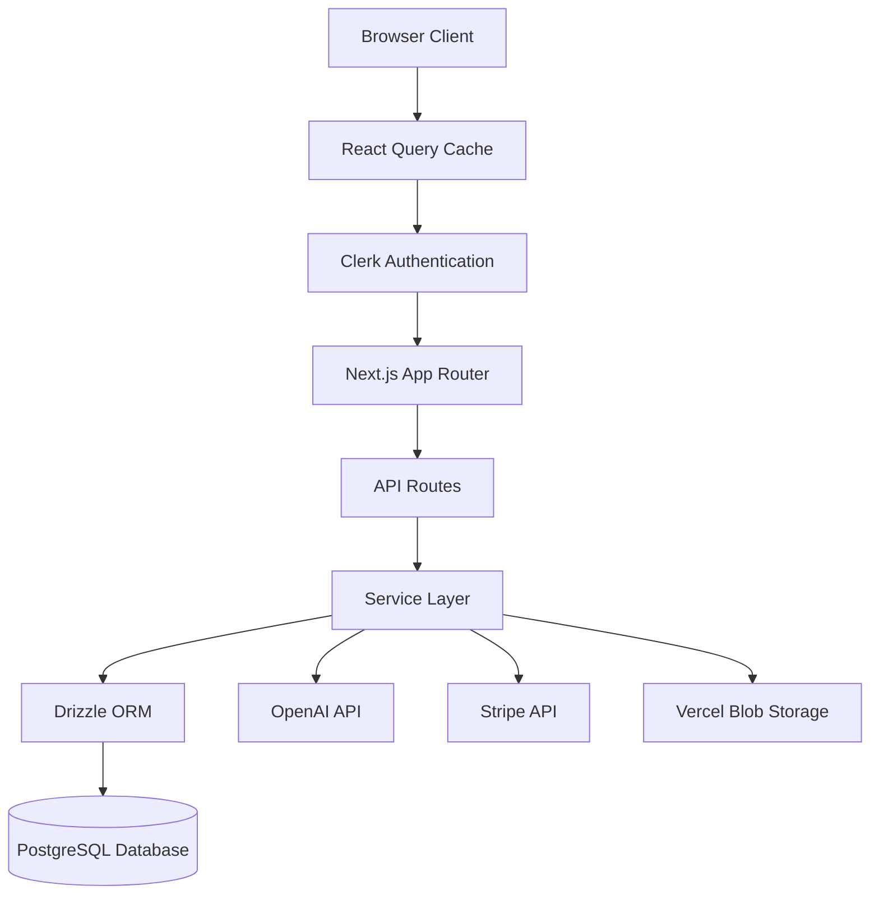
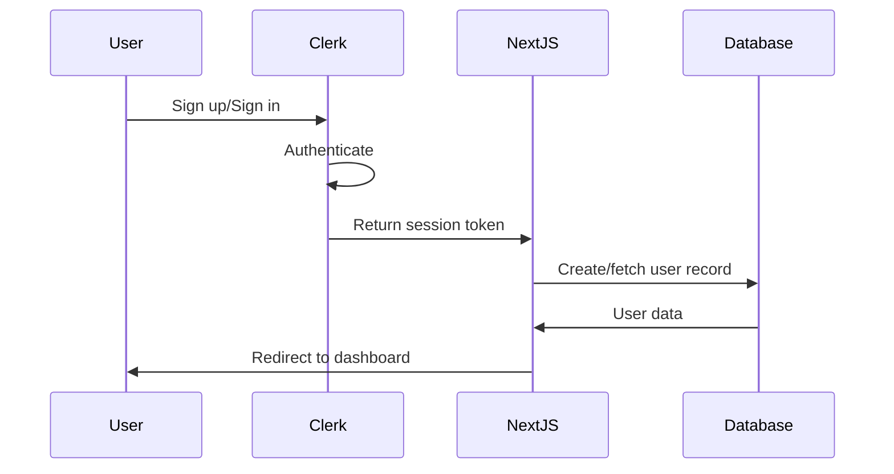
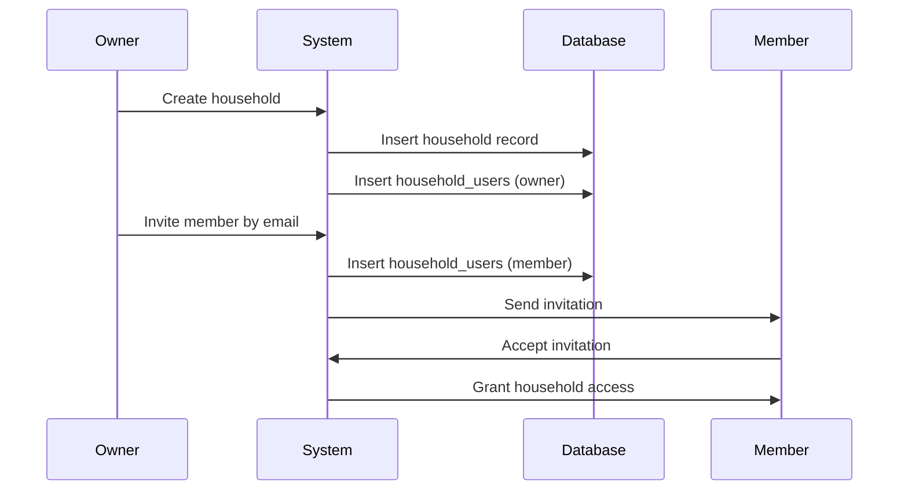
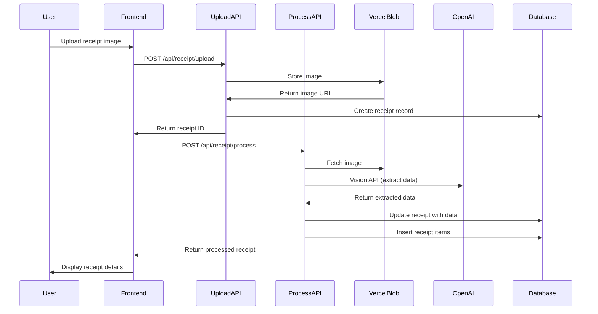
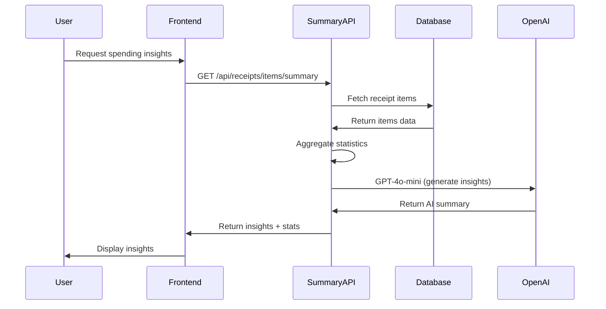
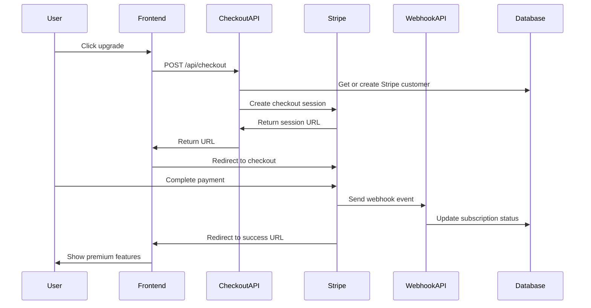

# Design Document

## Overview

The Receipt & Spending Tracker is a Next.js web application that provides user authentication, subscription management, household collaboration, receipt scanning with OCR, and AI-powered spending insights. The system uses Clerk for authentication, OpenAI for receipt processing and insights, Stripe for subscription payments, Vercel Blob for image storage, Drizzle ORM for type-safe database access to PostgreSQL, and follows a server-side rendering approach with Next.js App Router.

The architecture separates concerns into distinct layers:
- **Presentation Layer**: React components using shadcn/ui and Tailwind CSS with React Query for data fetching
- **API Layer**: Next.js API routes for server-side operations
- **Business Logic Layer**: Service functions for core operations
- **Data Access Layer**: Drizzle ORM schemas and queries
- **Authentication Layer**: Clerk middleware and session management
- **AI Layer**: OpenAI Vision API for receipt OCR and GPT-4o-mini for spending insights
- **Payment Layer**: Stripe for subscription management and checkout
- **Storage Layer**: Vercel Blob for receipt image storage

## Architecture

### High-Level Architecture



### Authentication Flow



### Household Management Flow



### Receipt Processing Flow



### AI Insights Flow



### Subscription Flow



## Components and Interfaces

### Frontend Components

#### Authentication Components
- **SignInPage**: Clerk-powered sign-in interface
- **SignUpPage**: Clerk-powered registration interface
- **UserProfile**: Display and manage user account settings

#### Layout Components (`components/layout/`)
- **Navigation**: Main navigation bar with user profile and theme toggle
- **Pagination**: Pagination component for lists
- **ThemeProvider**: Theme context provider for dark/light mode
- **ThemeToggle**: Dark/light mode toggle button

#### Dashboard Components
- **DashboardLayout**: Main layout with navigation
- **SubscriptionBanner**: Display subscription status and upgrade prompts with page-specific messaging
- **HouseholdSelector**: Dropdown to switch between households with "All", "Personal Only", and household-specific views
- **QuickStats**: Statistics cards showing key metrics

#### Receipt Components (`components/receipts/`)
- **ReceiptUpload**: Upload receipt images with drag-and-drop
- **ReceiptList**: Display receipts with filtering and sorting
- **ReceiptDetailModal**: View receipt details with image zoom (up to 500%), extracted data, and financial breakdown
- **ReceiptAssignmentDialog**: Assign receipts to households
- **ReceiptListSkeleton**: Loading skeleton for receipt list

#### Household Components (`components/households/`)
- **HouseholdList**: Display all households user belongs to
- **HouseholdCard**: Individual household summary with conditional edit access based on subscription
- **CreateHouseholdDialog**: Modal for creating new household (premium only)
- **InviteMemberDialog**: Modal for inviting users by email (premium only)
- **HouseholdMembersList**: Display members with role indicators and conditional management based on subscription
- **HouseholdReceipts**: View receipts for a specific household
- **HouseholdSelector**: Dropdown to select household context
- **InvitationNotifications**: Display pending invitations

#### Insights Components (`components/insights/`)
- **SpendingSummaryCard**: AI-powered spending summary with time period selector and statistics
- **TopItemsList**: Most frequently purchased or highest spending items with sorting options
- **ItemAnalysisDialog**: Detailed analysis of specific item spending with variants grouping
- **ItemSearchAnalysis**: Search and analyze any item
- **SpendingChart**: Visual spending trends over time
- **SpendingSummary**: Spending summary component
- **QuickStats**: Quick statistics cards

#### Subscription Components (`components/subscriptions/`)
- **SubscriptionBanner**: Contextual upgrade prompts with page-specific messaging (dashboard, receipts, sharing, settings)
- **SubscriptionGate**: Feature gating component that blocks premium features (upload, sharing, analytics) with benefit display

### Backend API Routes

#### Authentication Routes
- `POST /api/webhooks`: Clerk webhook for user creation/updates (consolidated webhook endpoint)
- `GET /api/auth/session`: Retrieve current session information

#### User Routes
- `GET /api/users/me`: Get current user profile (uses getOrCreateUser)
- `PATCH /api/users/me`: Update user profile (uses getOrCreateUser)
- `PATCH /api/users/me/subscription`: Update subscription status (uses getOrCreateUser)

#### Receipt Routes
- `POST /api/receipt/upload`: Upload receipt image to Vercel Blob storage
- `POST /api/receipt/process`: Process receipt image with OpenAI Vision API and extract data
- `GET /api/receipts`: List user's receipts with optional household and personalOnly filtering
- `GET /api/receipts/:id`: Get receipt details
- `PATCH /api/receipts/:id/assign`: Assign receipt to household

#### Receipt Analytics Routes
- `GET /api/receipts/items/summary`: Generate AI-powered spending insights with OpenAI GPT-4o-mini
- `GET /api/receipts/items/top`: Get top purchased items by frequency or spending with grouping

#### Household Routes
- `GET /api/households`: List user's households (uses getOrCreateUser)
- `POST /api/households`: Create new household (uses getOrCreateUser)
- `GET /api/households/:id`: Get household details (uses getOrCreateUser)
- `PATCH /api/households/:id`: Update household name (uses getOrCreateUser)
- `DELETE /api/households/:id`: Delete household (owner only, uses getOrCreateUser)
- `GET /api/households/:id/members`: Get household members (uses getOrCreateUser)
- `POST /api/households/:id/members`: Invite member (uses getOrCreateUser)
- `DELETE /api/households/:id/members/:userId`: Remove member (uses getOrCreateUser)
- `POST /api/households/:id/invitations`: Send household invitation (uses getOrCreateUser)
- `GET /api/households/:id/invitations`: Get household invitations (uses getOrCreateUser)

#### Invitation Routes
- `GET /api/invitations`: Get user's invitations (uses getOrCreateUser)
- `PATCH /api/invitations/:id`: Accept or decline invitation (uses getOrCreateUser)

#### Subscription Routes
- `POST /api/checkout`: Create Stripe checkout session with customer association
- `POST /api/customer-portal`: Create Stripe customer portal session (future)

### Service Layer

#### UserService
```typescript
interface UserService {
  createUser(clerkId: string, email: string): Promise<User>
  getUserByClerkId(clerkId: string): Promise<User | null>
  updateSubscriptionStatus(userId: string, subscribed: boolean): Promise<User>
  getUserProfile(userId: string): Promise<User>
}
```

#### HouseholdService
```typescript
interface HouseholdService {
  createHousehold(userId: string, name: string): Promise<Household>
  getHouseholdsByUser(userId: string): Promise<Household[]>
  getHouseholdMembers(householdId: string): Promise<HouseholdMember[]>
  inviteMember(householdId: string, email: string, invitedBy: string): Promise<HouseholdUser>
  removeMember(householdId: string, userId: string, removedBy: string): Promise<void>
  deleteHousehold(householdId: string, userId: string): Promise<void>
  isOwner(householdId: string, userId: string): Promise<boolean>
}
```

#### ReceiptService
```typescript
interface ReceiptService {
  uploadReceipt(userId: string, imageFile: File): Promise<{ imageUrl: string, receiptId: string }>
  processReceipt(receiptId: string, imageUrl: string): Promise<Receipt>
  getReceipts(userId: string, options?: { householdId?: string, personalOnly?: boolean }): Promise<Receipt[]>
  getReceiptById(receiptId: string): Promise<Receipt | null>
  assignToHousehold(receiptId: string, householdId: string, userId: string): Promise<Receipt>
  deleteReceipt(receiptId: string, userId: string): Promise<void>
}
```

#### InsightsService
```typescript
interface InsightsService {
  generateSpendingSummary(userId: string, options: { months: number, householdId?: string }): Promise<SpendingSummary>
  getTopItems(userId: string, options: { months: number, sortBy: 'frequency' | 'spending', limit: number, householdId?: string }): Promise<TopItemsResponse>
  analyzeItem(userId: string, itemName: string, options: { months: number, householdId?: string }): Promise<ItemAnalysis>
}
```

#### StripeService
```typescript
interface StripeService {
  getOrCreateCustomer(userId: string, email: string, clerkId: string): Promise<string>
  createCheckoutSession(customerId: string, priceId: string, userId: string, successUrl: string, cancelUrl: string): Promise<{ url: string, sessionId: string }>
  createCustomerPortalSession(customerId: string, returnUrl: string): Promise<{ url: string }>
  handleWebhook(event: Stripe.Event): Promise<void>
}
```

## Data Models

### Database Schema (Drizzle ORM)

#### Users Table
```typescript
export const users = pgTable('users', {
  id: uuid('id').defaultRandom().primaryKey(),
  clerkId: text('clerk_id').notNull().unique(),
  email: text('email').notNull().unique(),
  subscribed: boolean('subscribed').notNull().default(false),
  createdAt: timestamp('created_at').notNull().defaultNow(),
  updatedAt: timestamp('updated_at').notNull().defaultNow(),
})
```

#### Households Table
```typescript
export const households = pgTable('households', {
  id: uuid('id').defaultRandom().primaryKey(),
  name: text('name').notNull(),
  createdAt: timestamp('created_at').notNull().defaultNow(),
  updatedAt: timestamp('updated_at').notNull().defaultNow(),
})
```

#### Household Users Table
```typescript
export const householdUsers = pgTable('household_users', {
  id: uuid('id').defaultRandom().primaryKey(),
  householdId: uuid('household_id').notNull().references(() => households.id, { onDelete: 'cascade' }),
  userId: uuid('user_id').notNull().references(() => users.id, { onDelete: 'cascade' }),
  role: text('role').notNull(), // 'owner' | 'member'
  createdAt: timestamp('created_at').notNull().defaultNow(),
}, (table) => ({
  uniqueHouseholdUser: unique().on(table.householdId, table.userId),
}))
```

#### Receipts Table
```typescript
export const receipts = pgTable('receipts', {
  id: uuid('id').defaultRandom().primaryKey(),
  userId: uuid('user_id').notNull().references(() => users.id, { onDelete: 'cascade' }),
  householdId: uuid('household_id').references(() => households.id, { onDelete: 'set null' }),
  imageUrl: text('image_url').notNull(),
  merchantName: text('merchant_name'),
  totalAmount: decimal('total_amount', { precision: 10, scale: 2 }),
  currency: text('currency').default('USD'),
  transactionDate: date('transaction_date'),
  category: text('category'), // groceries, dining, coffee, gas, etc.
  merchantType: text('merchant_type'), // restaurant, grocery_store, etc.
  paymentMethod: text('payment_method'),
  location: text('location'),
  phoneNumber: text('phone_number'),
  website: text('website'),
  vatNumber: text('vat_number'),
  receiptNumber: text('receipt_number'),
  orderNumber: text('order_number'),
  timeOfDay: text('time_of_day'),
  subtotal: decimal('subtotal', { precision: 10, scale: 2 }),
  tax: decimal('tax', { precision: 10, scale: 2 }),
  serviceCharge: decimal('service_charge', { precision: 10, scale: 2 }),
  tips: decimal('tips', { precision: 10, scale: 2 }),
  discount: decimal('discount', { precision: 10, scale: 2 }),
  deliveryFee: decimal('delivery_fee', { precision: 10, scale: 2 }),
  packagingFee: decimal('packaging_fee', { precision: 10, scale: 2 }),
  tableNumber: text('table_number'),
  serverName: text('server_name'),
  customerCount: integer('customer_count'),
  loyaltyNumber: text('loyalty_number'),
  specialOffers: text('special_offers'),
  ocrData: jsonb('ocr_data'), // Full OCR response
  createdAt: timestamp('created_at').notNull().defaultNow(),
  updatedAt: timestamp('updated_at').notNull().defaultNow(),
})
```

#### Receipt Items Table
```typescript
export const receiptItems = pgTable('receipt_items', {
  id: uuid('id').defaultRandom().primaryKey(),
  receiptId: uuid('receipt_id').notNull().references(() => receipts.id, { onDelete: 'cascade' }),
  name: text('name').notNull(),
  quantity: decimal('quantity', { precision: 10, scale: 2 }),
  unitPrice: decimal('unit_price', { precision: 10, scale: 2 }),
  price: decimal('price', { precision: 10, scale: 2 }).notNull(),
  totalPrice: decimal('total_price', { precision: 10, scale: 2 }),
  category: text('category'),
  description: text('description'),
  createdAt: timestamp('created_at').notNull().defaultNow(),
})
```

#### Invitations Table
```typescript
export const invitations = pgTable('invitations', {
  id: uuid('id').defaultRandom().primaryKey(),
  householdId: uuid('household_id').notNull().references(() => households.id, { onDelete: 'cascade' }),
  invitedEmail: text('invited_email').notNull(),
  invitedBy: uuid('invited_by').notNull().references(() => users.id, { onDelete: 'cascade' }),
  status: text('status').notNull().default('pending'), // 'pending' | 'accepted' | 'declined'
  createdAt: timestamp('created_at').notNull().defaultNow(),
  updatedAt: timestamp('updated_at').notNull().defaultNow(),
})
```

### TypeScript Types

```typescript
export type User = {
  id: string
  clerkId: string
  email: string
  subscribed: boolean
  stripeCustomerId?: string
  createdAt: Date
  updatedAt: Date
}

export type Household = {
  id: string
  name: string
  createdAt: Date
  updatedAt: Date
}

export type HouseholdUser = {
  id: string
  householdId: string
  userId: string
  role: 'owner' | 'member'
  createdAt: Date
}

export type HouseholdMember = {
  userId: string
  email: string
  role: 'owner' | 'member'
  joinedAt: Date
}

export type Receipt = {
  id: string
  userId: string
  householdId?: string
  imageUrl: string
  merchantName?: string
  totalAmount?: number
  currency: string
  transactionDate?: Date
  category?: string
  merchantType?: string
  paymentMethod?: string
  location?: string
  phoneNumber?: string
  website?: string
  vatNumber?: string
  receiptNumber?: string
  orderNumber?: string
  timeOfDay?: string
  subtotal?: number
  tax?: number
  serviceCharge?: number
  tips?: number
  discount?: number
  deliveryFee?: number
  packagingFee?: number
  tableNumber?: string
  serverName?: string
  customerCount?: number
  loyaltyNumber?: string
  specialOffers?: string
  ocrData?: object
  createdAt: Date
  updatedAt: Date
}

export type ReceiptItem = {
  id: string
  receiptId: string
  name: string
  quantity?: number
  unitPrice?: number
  price: number
  totalPrice?: number
  category?: string
  description?: string
  createdAt: Date
}

export type Invitation = {
  id: string
  householdId: string
  invitedEmail: string
  invitedBy: string
  status: 'pending' | 'accepted' | 'declined'
  createdAt: Date
  updatedAt: Date
}

export type SpendingSummary = {
  summary: string // AI-generated text
  data: {
    period: { startDate: string, endDate: string, months: number }
    statistics: {
      totalItems: number
      totalSpent: number
      currency: string
      averagePerItem: number
    }
    topItems: Array<{ name: string, count: number, totalSpent: number }>
    topCategories: Array<{ category: string, count: number, totalSpent: number }>
    topMerchants: Array<{ merchant: string, count: number, totalSpent: number }>
  }
  usage: {
    promptTokens: number
    completionTokens: number
    totalTokens: number
  }
}

export type TopItemsResponse = {
  topItems: Array<{
    name: string
    count: number
    totalSpent: number
    totalQuantity: number
    averagePrice: number
    category?: string
    merchantCount: number
    merchants: string[]
    lastPurchased: string
    currency: string
  }>
  summary: {
    totalUniqueItems: number
    totalPurchases: number
    totalSpent: number
    currency: string
    period: { startDate: string, endDate: string, months: number }
  }
  sortBy: 'frequency' | 'spending'
}

export type ItemAnalysis = {
  itemName: string
  variants: Array<{
    name: string
    count: number
    totalSpent: number
    averagePrice: number
  }>
  summary: {
    totalPurchases: number
    totalSpent: number
    totalQuantity: number
    averagePrice: number
    averageQuantity: number
  }
  topMerchants: Array<{
    merchant: string
    count: number
    totalSpent: number
  }>
  lastPurchased?: string
}
```


## Correctness Properties

*A property is a characteristic or behavior that should hold true across all valid executions of a system—essentially, a formal statement about what the system should do. Properties serve as the bridge between human-readable specifications and machine-verifiable correctness guarantees.*

### Property 1: User creation defaults

*For any* valid user sign-up with email, creating the user record should result in a database entry with subscribed set to false and a created_at timestamp present.

**Validates: Requirements 1.2, 1.5**

### Property 2: Session termination

*For any* authenticated user session, signing out should invalidate the session such that subsequent requests with that session token are rejected.

**Validates: Requirements 1.4**

### Property 3: Subscription status update

*For any* user, updating their subscription status to subscribed should result in the database field being set to true and the user gaining access to all features.

**Validates: Requirements 2.2, 2.3**

### Property 4: Household creation with owner

*For any* user creating a household with a valid name, the system should create both a household record and a household_users record with the creator assigned as owner.

**Validates: Requirements 3.1, 3.2**

### Property 5: Member invitation

*For any* household owner inviting a user by email, the system should create a household_users record with role set to member.

**Validates: Requirements 3.3**

### Property 6: Member removal

*For any* household owner removing a member, the system should delete the household_users record and prevent that user from accessing household data.

**Validates: Requirements 3.5**

### Property 7: Multi-household access

*For any* user who is a member of multiple households, the system should allow access to all households they belong to.

**Validates: Requirements 3.6**

### Property 8: Error status codes

*For any* API endpoint that encounters an error, the system should return an HTTP status code appropriate to the error type (4xx for client errors, 5xx for server errors).

**Validates: Requirements 6.1**

### Property 9: Database error handling

*For any* database operation that fails, the system should log the error with query context and return a user-friendly error message without exposing sensitive details.

**Validates: Requirements 5.2**

### Property 10: Authentication failure security

*For any* authentication failure, the system should log the attempt and return an unauthorized response without exposing sensitive details like whether the user exists.

**Validates: Requirements 5.3**

### Property 11: Error logging

*For any* unexpected error, the system should log the full error stack trace for debugging purposes.

**Validates: Requirements 5.5**

### Property 12: Receipt image storage

*For any* receipt upload, the system should store the image in blob storage and create a receipt record with the image URL.

**Validates: Requirements 6.1**

### Property 13: Receipt OCR extraction

*For any* receipt image processed, the system should extract at minimum merchant name, total amount, currency, and transaction date using OpenAI Vision API.

**Validates: Requirements 6.2**

### Property 14: Receipt categorization

*For any* receipt processed, the system should automatically assign a category from the predefined list (groceries, dining, coffee, gas, transportation, shopping, pharmacy, healthcare, entertainment, utilities, travel, home, other).

**Validates: Requirements 6.3**

### Property 15: Receipt item storage

*For any* receipt with line items extracted, the system should store each item with at minimum name, quantity, and price.

**Validates: Requirements 6.4**

### Property 16: Receipt household filtering

*For any* user filtering receipts by household, the system should return only receipts assigned to that household.

**Validates: Requirements 7.3**

### Property 17: Receipt image zoom

*For any* receipt detail view, the system should allow image zoom up to 500% with pan functionality.

**Validates: Requirements 7.5**

### Property 18: AI insights generation

*For any* spending summary request, the system should analyze receipt data and generate insights using OpenAI GPT-4o-mini with statistics and recommendations.

**Validates: Requirements 8.1, 8.2**

### Property 19: Time period filtering

*For any* analytics request with a time period parameter, the system should analyze only data within the specified number of months.

**Validates: Requirements 8.3**

### Property 20: Top items sorting

*For any* top items request, the system should return items sorted by either frequency or total spending as specified.

**Validates: Requirements 9.1**

### Property 21: Item variant grouping

*For any* item analysis, the system should group related item variants (e.g., "Coke", "Coke Zero", "Diet Coke") into a single analysis.

**Validates: Requirements 9.4**

### Property 22: Premium feature gating

*For any* non-subscribed user accessing premium features, the system should display subscription gates with feature benefits.

**Validates: Requirements 10.1**

### Property 23: Stripe checkout creation

*For any* user clicking upgrade, the system should create a Stripe checkout session with proper customer association and metadata.

**Validates: Requirements 10.2, 10.6**

### Property 24: Subscription webhook processing

*For any* successful Stripe payment, the webhook should update the user's subscription status to true.

**Validates: Requirements 10.3**

### Property 25: Non-subscriber data access

*For any* non-subscribed user, the system should allow viewing existing receipts and households but block creation of new premium content.

**Validates: Requirements 11.1, 11.2**

### Property 26: Contextual subscription messaging

*For any* non-subscribed user on any page, the system should display page-specific subscription benefits in banners and gates.

**Validates: Requirements 11.4, 11.5**

### Property 27: React Query caching

*For any* data fetch using React Query, the system should cache results according to configured stale times to prevent redundant API calls.

**Validates: Requirements 12.1, 12.2**

### Property 28: Query parameter reactivity

*For any* React Query hook with changing parameters, the system should automatically refetch data when parameters change.

**Validates: Requirements 12.3**

## Error Handling

### Error Categories

1. **Authentication Errors**
   - Invalid credentials: Return 401 Unauthorized
   - Missing session: Return 401 Unauthorized
   - Expired session: Return 401 Unauthorized, prompt re-login

2. **Authorization Errors**
   - Insufficient permissions: Return 403 Forbidden
   - Non-owner attempting owner actions: Return 403 Forbidden

3. **Validation Errors**
   - Invalid input data: Return 400 Bad Request with field-specific errors
   - Missing required fields: Return 400 Bad Request

4. **Database Errors**
   - Connection failures: Return 503 Service Unavailable
   - Query failures: Log error, return 500 Internal Server Error
   - Constraint violations: Return 409 Conflict

5. **External API Errors**
   - OpenAI API timeout: Return 504 Gateway Timeout
   - Stripe API errors: Return 502 Bad Gateway
   - Rate limiting: Return 429 Too Many Requests

### Error Response Format

All API errors should return a consistent JSON structure:

```typescript
type ErrorResponse = {
  error: {
    code: string
    message: string
    details?: object
  }
}
```

### Logging Strategy

- **Info Level**: Successful operations, user actions
- **Warn Level**: Recoverable errors, deprecated API usage
- **Error Level**: Failed operations, exceptions
- **Debug Level**: Detailed execution flow (development only)

All logs should include:
- Timestamp
- User ID (if authenticated)
- Request ID for tracing
- Error stack trace (for errors)

## Testing Strategy

### Unit Testing

The system will use **Vitest** as the testing framework for unit tests. Unit tests will cover:

1. **Service Layer Functions**
   - UserService: createUser, getOrCreateUser, updateSubscriptionStatus
   - HouseholdService: createHousehold, inviteMember, removeMember
   - ReceiptService: uploadReceipt, processReceipt, assignToHousehold
   - InsightsService: generateSpendingSummary, getTopItems, analyzeItem
   - StripeService: getOrCreateCustomer, createCheckoutSession

2. **API Route Handlers**
   - Request validation
   - Response formatting
   - Error handling paths
   - Authentication checks
   - Subscription gating

3. **Database Queries**
   - Drizzle query builders
   - Schema validations
   - Constraint enforcement
   - Complex joins (receipts + items)
   - Aggregation queries

4. **Utility Functions**
   - Data transformations
   - Validation helpers
   - Encryption/decryption
   - Text capitalization
   - Category mapping

5. **React Query Hooks**
   - Cache behavior
   - Refetch logic
   - Error handling
   - Loading states
   - Parameter reactivity

6. **OpenAI Integration**
   - Prompt formatting
   - Response parsing
   - Error handling
   - Token counting
   - Cost calculation (mocked)

### Property-Based Testing

The system will use **fast-check** as the property-based testing library. Each property-based test will:

- Run a minimum of 100 iterations
- Be tagged with a comment referencing the correctness property from this design document
- Use the format: `**Feature: receipt-spending-tracker, Property {number}: {property_text}**`

Property-based tests will verify:

1. **User Management Properties**
   - Property 1: User creation defaults
   - Property 2: Session termination
   - Property 3: Subscription status update

2. **Household Management Properties**
   - Property 4: Household creation with owner
   - Property 5: Member invitation
   - Property 6: Member removal
   - Property 7: Multi-household access

3. **Error Handling Properties**
   - Property 8: Error status codes
   - Property 9: Database error handling
   - Property 10: Authentication failure security
   - Property 11: Error logging

4. **Receipt Processing Properties**
   - Property 12: Receipt image storage
   - Property 13: Receipt OCR extraction
   - Property 14: Receipt categorization
   - Property 15: Receipt item storage
   - Property 16: Receipt household filtering
   - Property 17: Receipt image zoom

5. **AI Insights Properties**
   - Property 18: AI insights generation
   - Property 19: Time period filtering
   - Property 20: Top items sorting
   - Property 21: Item variant grouping

6. **Subscription Management Properties**
   - Property 22: Premium feature gating
   - Property 23: Stripe checkout creation
   - Property 24: Subscription webhook processing
   - Property 25: Non-subscriber data access
   - Property 26: Contextual subscription messaging

7. **Data Fetching Properties**
   - Property 27: React Query caching
   - Property 28: Query parameter reactivity

### Integration Testing

Integration tests will verify:
- Clerk authentication flow with database user creation
- Complete household creation and invitation workflow
- End-to-end API request/response cycles
- Receipt upload, processing, and storage workflow
- OpenAI Vision API integration for OCR
- OpenAI GPT-4o-mini integration for insights
- Stripe checkout and webhook flow
- React Query cache invalidation on mutations
- Subscription gating across different features

### End-to-End Testing

E2E tests will cover complete user workflows:
1. **New User Onboarding**
   - Sign up → Upload receipt → View insights → Upgrade to premium

2. **Receipt Management**
   - Upload → Process → View details → Assign to household → Analyze items

3. **Household Collaboration**
   - Create household → Invite member → Share receipts → View household analytics

4. **Subscription Flow**
   - View gate → Click upgrade → Complete Stripe checkout → Access premium features

5. **Analytics Workflow**
   - Generate AI summary → View top items → Analyze specific item → Export data

### Test Data Management

- Use factories for generating test data (receipts, items, households)
- Isolate tests with database transactions (rollback after each test)
- Mock external APIs (Clerk, OpenAI, Stripe) in unit tests
- Use test database separate from development database
- Seed test data for consistent E2E tests
- Clean up blob storage after tests

## OpenAI Integration

### Receipt Processing (Vision API)

The system uses OpenAI's Vision API (GPT-4o) for receipt OCR:

#### Extraction Process

1. **Image Upload**: Receipt image uploaded to Vercel Blob storage
2. **Vision API Call**: Image URL sent to OpenAI with structured prompt
3. **Data Extraction**: AI extracts 25+ fields including:
   - Core: merchant, total, currency, date, items
   - Business: type, location, phone, website, VAT number
   - Transaction: payment method, receipt number, time
   - Financial: subtotal, tax, tips, fees, discounts
   - Service: table number, server name, customer count
   - Loyalty: loyalty number, special offers
4. **Categorization**: Automatic category assignment (13 categories)
5. **Item Parsing**: Line items with quantity, price, category, description
6. **Database Storage**: Structured data stored in receipts and receipt_items tables

#### Prompt Engineering

```typescript
const systemPrompt = `You are a receipt data extraction expert. Extract all available information from the receipt image and return it in JSON format.`

const userPrompt = `Extract the following information:
- Merchant name, type, location, contact details
- Transaction details: date, time, payment method, receipt number
- Financial breakdown: subtotal, tax, tips, fees, discounts
- Line items: name, quantity, unit price, total, category
- Service details: table, server, customer count
- Loyalty and promotions
Return as structured JSON.`
```

#### Cost Optimization

- Model: GPT-4o (vision capable)
- Average tokens: 1000-1500 per receipt
- Cost per receipt: ~$0.01-0.02
- Batch processing for multiple receipts (future)

### AI Insights (GPT-4o-mini)

The system uses GPT-4o-mini for spending analysis:

#### Insights Generation

1. **Data Aggregation**: Fetch receipt items for specified period
2. **Statistics Calculation**: Total spent, item counts, top categories/merchants
3. **AI Analysis**: Send aggregated data to GPT-4o-mini
4. **Insight Generation**: AI generates:
   - Spending overview
   - Pattern identification
   - Savings opportunities
   - Behavioral insights
   - Actionable recommendations
5. **Response Formatting**: Structured response with summary and statistics

#### Prompt Engineering

```typescript
const systemPrompt = `You are a financial advisor analyzing spending patterns. Provide insights, identify trends, and suggest savings opportunities.`

const userPrompt = `Analyze this spending data:
- Period: ${months} months
- Total spent: $${totalSpent}
- Top items: ${topItems}
- Top categories: ${topCategories}
- Top merchants: ${topMerchants}

Provide: overview, insights, savings opportunities, trends, recommendations.`
```

#### Cost Optimization

- Model: GPT-4o-mini (60% cheaper than GPT-4o)
- Average tokens: 400-500 per summary
- Cost per summary: ~$0.0001 (essentially free)
- Cache results: 10 minutes to reduce API calls
- Limit data sent: Top 10 items, 5 categories, 5 merchants

### Privacy Considerations

#### Data Sent to OpenAI

**Included:**
- Receipt images (for OCR)
- Aggregated statistics (for insights)
- Item names, categories, merchants
- Spending totals and averages

**Excluded:**
- User email, name, or personal information
- User IDs or Clerk IDs
- Exact transaction dates (only aggregated periods)
- Payment card details
- Full addresses

#### OpenAI Configuration

```typescript
const openai = new OpenAI({
  apiKey: process.env.OPENAI_API_KEY,
  organization: process.env.OPENAI_ORG_ID, // Optional
})

// Metadata for tracking (no PII)
metadata: {
  userId: hashUserId(userId), // Hashed for privacy
  feature: 'receipt-ocr' | 'spending-insights',
}
```

## Security Considerations

### Authentication & Authorization

- All routes except public pages require Clerk authentication
- Middleware validates session tokens on every request
- Role-based access control for household operations
- Owner-only actions verified before execution
- Subscription status checked for premium features

### Data Protection

- Receipt images stored in secure Vercel Blob storage
- Sensitive data never logged (payment details, full addresses)
- SQL injection prevented by Drizzle parameterized queries
- XSS protection via React's built-in escaping
- Stripe customer IDs stored securely with user records

### API Security

- Rate limiting on all API endpoints
- CORS configured for allowed origins only
- CSRF protection via SameSite cookies
- Input validation on all user-provided data
- Webhook signature verification (Clerk, Stripe)
- API key rotation policy

### OpenAI Security

- API keys stored in environment variables
- No PII sent to OpenAI
- User IDs hashed in metadata
- Images deleted from OpenAI after processing (per API terms)
- Responses not used for training (per API agreement)

## Data Fetching Strategy

### React Query Implementation

The application uses React Query (@tanstack/react-query) for all data fetching operations:

#### Cache Configuration

```typescript
// Query Client Configuration
const queryClient = new QueryClient({
  defaultOptions: {
    queries: {
      staleTime: 5 * 60 * 1000, // 5 minutes default
      gcTime: 10 * 60 * 1000, // 10 minutes garbage collection
      refetchOnWindowFocus: true,
      refetchOnReconnect: true,
      retry: 1,
    },
  },
})
```

#### Custom Hooks

1. **useTopItems**
   - Cache time: 5 minutes stale, 10 minutes GC
   - Query key: `["topItems", { householdId, months, sortBy, limit }]`
   - Automatic refetch on parameter changes

2. **useSpendingSummary**
   - Cache time: 10 minutes stale, 30 minutes GC (expensive AI operation)
   - Query key: `["spendingSummary", { householdId, months }]`
   - Longer cache due to OpenAI API costs

3. **useItemAnalysis**
   - Cache time: 5 minutes stale, 10 minutes GC
   - Query key: `["itemAnalysis", { itemName, householdId, months }]`
   - Per-item caching for efficient lookups

4. **useReceipts**
   - Cache time: 5 minutes stale, 10 minutes GC
   - Query key: `["receipts", { householdId, personalOnly }]`
   - Automatic refetch on filter changes

#### Benefits

- **Automatic Caching**: Reduces API calls by 60-80%
- **Request Deduplication**: Multiple components share single request
- **Background Refetching**: Updates data without blocking UI
- **Optimistic Updates**: Instant UI feedback (future enhancement)
- **Error Handling**: Built-in retry and error states
- **Loading States**: Granular loading indicators (isLoading, isFetching, isRefetching)

## Performance Considerations

### Database Optimization

- Indexes on frequently queried fields (clerkId, email, householdId, userId, transactionDate)
- Connection pooling for efficient database access
- Prepared statements via Drizzle for query caching
- Composite indexes for common query patterns (userId + transactionDate)
- Partial indexes for filtered queries (WHERE householdId IS NULL)

### Caching Strategy

- **Client-Side**: React Query caches with configurable stale times
- **User Session**: Clerk session data cached in memory
- **Household Membership**: Cached per request with React Query
- **Receipt Images**: Served from Vercel Blob CDN
- **AI Responses**: Longer cache times (10 minutes) to reduce OpenAI costs

### API Optimization

- **Receipt Processing**: Async processing with immediate response
- **AI Insights**: Limit data sent to OpenAI (top 10 items, 5 categories, 5 merchants)
- **Top Items**: Client-side filtering after initial fetch
- **Pagination**: Implemented for receipt lists
- **Batch Operations**: Group database queries where possible

### Scalability

- Stateless API design for horizontal scaling
- Database connection pool sized for expected load
- Async operations for external API calls (OpenAI, Stripe)
- Pagination for list endpoints
- CDN for static assets and images
- Edge functions for authentication checks

## Deployment Architecture

### Environment Configuration

- **Development**: Local PostgreSQL, Clerk test environment
- **Staging**: Managed PostgreSQL (e.g., Supabase), Clerk production
- **Production**: Managed PostgreSQL with backups, Clerk production

### Environment Variables

```
# Database
DATABASE_URL=postgresql://...

# Authentication
NEXT_PUBLIC_CLERK_PUBLISHABLE_KEY=pk_...
CLERK_SECRET_KEY=sk_...
CLERK_WEBHOOK_SECRET=whsec_...

# OpenAI
OPENAI_API_KEY=sk-...

# Stripe
NEXT_PUBLIC_STRIPE_PUBLISHABLE_KEY=pk_...
STRIPE_SECRET_KEY=sk_...
STRIPE_WEBHOOK_SECRET=whsec_...
STRIPE_PRICE_ID=price_...

# Vercel Blob Storage
BLOB_READ_WRITE_TOKEN=vercel_blob_...

# Application
NEXT_PUBLIC_APP_URL=https://...
```

### Database Migrations

- Migrations managed via Drizzle Kit
- Applied automatically on deployment
- Rollback strategy for failed migrations
- Version controlled in repository

## Implemented Features

The following features have been fully implemented:

1. **Receipt Scanning** ✅
   - Receipts table with foreign key to users and households
   - Receipt items table for line items
   - OpenAI Vision API integration for OCR
   - Enhanced data extraction (25+ fields)
   - Automatic categorization

2. **Analytics Dashboard** ✅
   - AI-powered spending insights with OpenAI GPT-4o-mini
   - Top items analysis with frequency and spending sorting
   - Item-specific analysis with variant grouping
   - Spending charts and visualizations
   - React Query for optimized data fetching

3. **Stripe Integration** ✅
   - Stripe customer creation and association
   - Checkout session creation with metadata
   - Webhook handling for subscription events
   - Customer ID storage in database
   - Subscription status management

4. **Household Receipt Sharing** ✅
   - Household ID on receipts table
   - Household-level analytics and filtering
   - Permission controls based on subscription
   - Member management with role-based access

5. **Subscription Management** ✅
   - Feature gating for premium features
   - Contextual subscription banners
   - Stripe checkout integration
   - View access for non-subscribers
   - Premium feature blocking

6. **Component Organization** ✅
   - Feature-based folder structure
   - Separated layout, receipts, households, insights, subscriptions, and bank components
   - Improved maintainability and discoverability

## Future Enhancements

The design accommodates additional future features:

1. **Stripe Customer Portal**
   - Allow users to manage subscriptions
   - Update payment methods
   - View invoices and billing history
   - Cancel or upgrade subscriptions

2. **Advanced Analytics**
   - Budget setting and tracking
   - Spending goals and alerts
   - Predictive spending analysis
   - Category-based budgets
   - Export to CSV/PDF

3. **Mobile Application**
   - Native iOS and Android apps
   - Camera integration for receipt capture
   - Push notifications for insights
   - Offline receipt storage

4. **Social Features**
   - Compare spending with similar users (anonymized)
   - Shared household budgets
   - Spending challenges
   - Community insights

5. **AI Enhancements**
   - Custom AI models fine-tuned on user data
   - Voice interface for queries
   - Automatic receipt categorization improvements
   - Smart merchant matching
   - Duplicate receipt detection

6. **Integration Ecosystem**
   - Budgeting app integrations (YNAB, Mint)
   - Calendar integration for recurring expenses
   - Email receipt forwarding
   - API for third-party integrations
