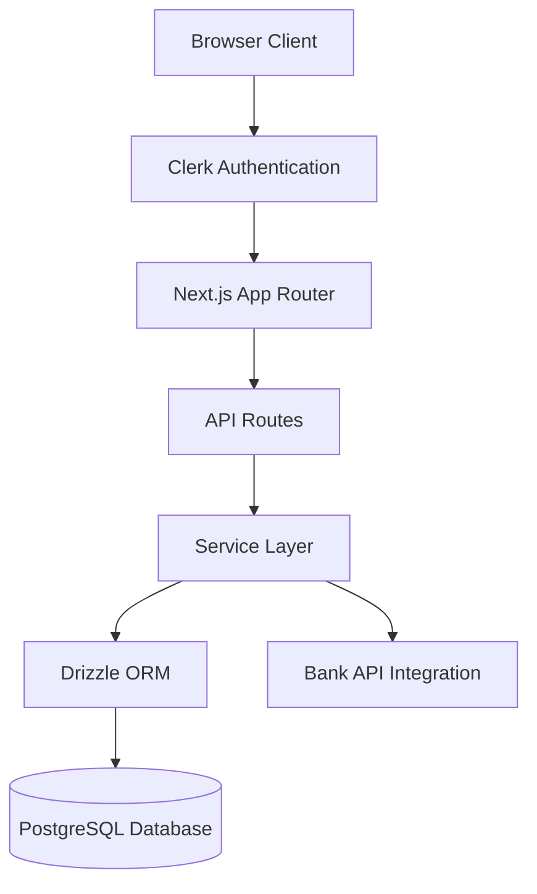
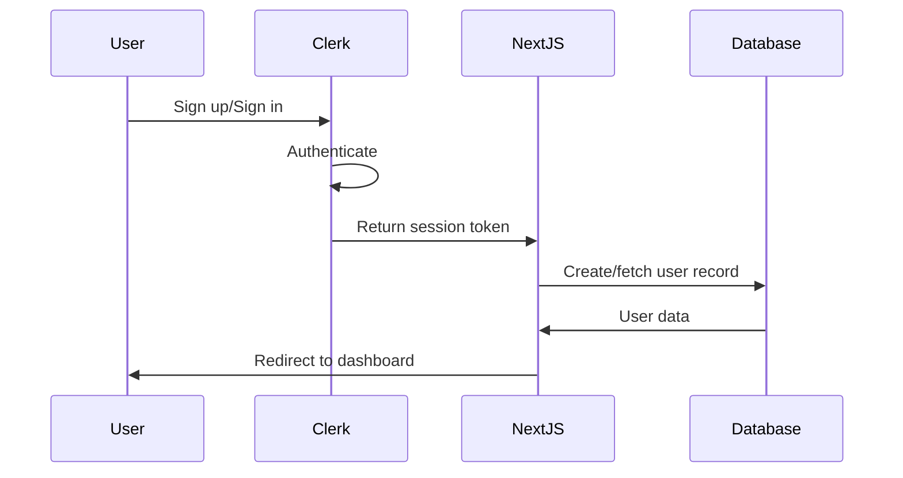
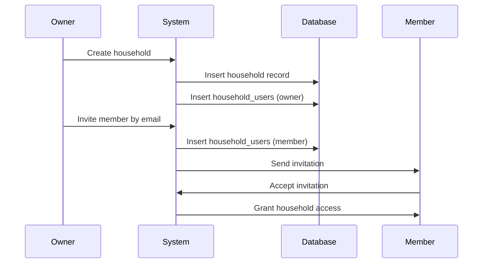

# Design Document

## Overview

The Receipt & Spending Tracker is a Next.js web application that provides user authentication, subscription management, household collaboration, and bank account integration. The system uses Clerk for authentication, Drizzle ORM for type-safe database access to PostgreSQL, and follows a server-side rendering approach with Next.js App Router.

The architecture separates concerns into distinct layers:
- **Presentation Layer**: React components using shadcn/ui and Tailwind CSS
- **API Layer**: Next.js API routes for server-side operations
- **Business Logic Layer**: Service functions for core operations
- **Data Access Layer**: Drizzle ORM schemas and queries
- **Authentication Layer**: Clerk middleware and session management

## Architecture

### High-Level Architecture



### Authentication Flow



### Household Management Flow



## Components and Interfaces

### Frontend Components

#### Authentication Components
- **SignInPage**: Clerk-powered sign-in interface
- **SignUpPage**: Clerk-powered registration interface
- **UserProfile**: Display and manage user account settings

#### Dashboard Components
- **DashboardLayout**: Main layout with navigation
- **SubscriptionBanner**: Display subscription status and upgrade prompts
- **HouseholdSelector**: Dropdown to switch between households

#### Household Components
- **HouseholdList**: Display all households user belongs to
- **HouseholdCard**: Individual household summary
- **CreateHouseholdDialog**: Modal for creating new household
- **InviteMemberDialog**: Modal for inviting users by email
- **HouseholdMembersList**: Display members with role indicators
- **RemoveMemberButton**: Action to remove members (owner only)

#### Bank Connection Components
- **BankConnectionList**: Display connected banks
- **AddBankDialog**: Modal for initiating bank connection
- **BankConnectionCard**: Individual bank connection status
- **DisconnectBankButton**: Action to remove bank connection

### Backend API Routes

#### Authentication Routes
- `POST /api/auth/webhook`: Clerk webhook for user creation/updates
- `GET /api/auth/session`: Retrieve current session information

#### User Routes
- `GET /api/users/me`: Get current user profile
- `PATCH /api/users/me`: Update user profile
- `PATCH /api/users/me/subscription`: Update subscription status

#### Household Routes
- `GET /api/households`: List user's households
- `POST /api/households`: Create new household
- `GET /api/households/:id`: Get household details
- `PATCH /api/households/:id`: Update household name
- `DELETE /api/households/:id`: Delete household (owner only)
- `POST /api/households/:id/members`: Invite member
- `DELETE /api/households/:id/members/:userId`: Remove member

#### Bank Connection Routes
- `GET /api/bank-connections`: List user's bank connections
- `POST /api/bank-connections`: Initiate bank connection
- `DELETE /api/bank-connections/:id`: Disconnect bank
- `POST /api/bank-connections/:id/refresh`: Manually refresh connection

### Service Layer

#### UserService
```typescript
interface UserService {
  createUser(clerkId: string, email: string): Promise<User>
  getUserByClerkId(clerkId: string): Promise<User | null>
  updateSubscriptionStatus(userId: string, subscribed: boolean): Promise<User>
  getUserProfile(userId: string): Promise<User>
}
```

#### HouseholdService
```typescript
interface HouseholdService {
  createHousehold(userId: string, name: string): Promise<Household>
  getHouseholdsByUser(userId: string): Promise<Household[]>
  getHouseholdMembers(householdId: string): Promise<HouseholdMember[]>
  inviteMember(householdId: string, email: string, invitedBy: string): Promise<HouseholdUser>
  removeMember(householdId: string, userId: string, removedBy: string): Promise<void>
  deleteHousehold(householdId: string, userId: string): Promise<void>
  isOwner(householdId: string, userId: string): Promise<boolean>
}
```

#### BankConnectionService
```typescript
interface BankConnectionService {
  createConnection(userId: string, bankName: string, credentials: object): Promise<BankConnection>
  getConnectionsByUser(userId: string): Promise<BankConnection[]>
  disconnectBank(connectionId: string, userId: string): Promise<void>
  refreshConnection(connectionId: string): Promise<BankConnection>
  validateCredentials(bankName: string, credentials: object): Promise<boolean>
}
```

## Data Models

### Database Schema (Drizzle ORM)

#### Users Table
```typescript
export const users = pgTable('users', {
  id: uuid('id').defaultRandom().primaryKey(),
  clerkId: text('clerk_id').notNull().unique(),
  email: text('email').notNull().unique(),
  subscribed: boolean('subscribed').notNull().default(false),
  createdAt: timestamp('created_at').notNull().defaultNow(),
  updatedAt: timestamp('updated_at').notNull().defaultNow(),
})
```

#### Households Table
```typescript
export const households = pgTable('households', {
  id: uuid('id').defaultRandom().primaryKey(),
  name: text('name').notNull(),
  createdAt: timestamp('created_at').notNull().defaultNow(),
  updatedAt: timestamp('updated_at').notNull().defaultNow(),
})
```

#### Household Users Table
```typescript
export const householdUsers = pgTable('household_users', {
  id: uuid('id').defaultRandom().primaryKey(),
  householdId: uuid('household_id').notNull().references(() => households.id, { onDelete: 'cascade' }),
  userId: uuid('user_id').notNull().references(() => users.id, { onDelete: 'cascade' }),
  role: text('role').notNull(), // 'owner' | 'member'
  createdAt: timestamp('created_at').notNull().defaultNow(),
}, (table) => ({
  uniqueHouseholdUser: unique().on(table.householdId, table.userId),
}))
```

#### Bank Connections Table
```typescript
export const bankConnections = pgTable('bank_connections', {
  id: uuid('id').defaultRandom().primaryKey(),
  userId: uuid('user_id').notNull().references(() => users.id, { onDelete: 'cascade' }),
  bankName: text('bank_name').notNull(),
  status: text('status').notNull(), // 'active' | 'inactive' | 'error'
  credentials: jsonb('credentials').notNull(), // Encrypted credentials
  lastSyncedAt: timestamp('last_synced_at'),
  createdAt: timestamp('created_at').notNull().defaultNow(),
  updatedAt: timestamp('updated_at').notNull().defaultNow(),
})
```

### TypeScript Types

```typescript
export type User = {
  id: string
  clerkId: string
  email: string
  subscribed: boolean
  createdAt: Date
  updatedAt: Date
}

export type Household = {
  id: string
  name: string
  createdAt: Date
  updatedAt: Date
}

export type HouseholdUser = {
  id: string
  householdId: string
  userId: string
  role: 'owner' | 'member'
  createdAt: Date
}

export type HouseholdMember = {
  userId: string
  email: string
  role: 'owner' | 'member'
  joinedAt: Date
}

export type BankConnection = {
  id: string
  userId: string
  bankName: string
  status: 'active' | 'inactive' | 'error'
  credentials: object
  lastSyncedAt: Date | null
  createdAt: Date
  updatedAt: Date
}
```


## Correctness Properties

*A property is a characteristic or behavior that should hold true across all valid executions of a system—essentially, a formal statement about what the system should do. Properties serve as the bridge between human-readable specifications and machine-verifiable correctness guarantees.*

### Property 1: User creation defaults

*For any* valid user sign-up with email, creating the user record should result in a database entry with subscribed set to false and a created_at timestamp present.

**Validates: Requirements 1.2, 1.5**

### Property 2: Session termination

*For any* authenticated user session, signing out should invalidate the session such that subsequent requests with that session token are rejected.

**Validates: Requirements 1.4**

### Property 3: Subscription status update

*For any* user, updating their subscription status to subscribed should result in the database field being set to true and the user gaining access to all features.

**Validates: Requirements 2.2, 2.3**

### Property 4: Household creation with owner

*For any* user creating a household with a valid name, the system should create both a household record and a household_users record with the creator assigned as owner.

**Validates: Requirements 3.1, 3.2**

### Property 5: Member invitation

*For any* household owner inviting a user by email, the system should create a household_users record with role set to member.

**Validates: Requirements 3.3**

### Property 6: Member removal

*For any* household owner removing a member, the system should delete the household_users record and prevent that user from accessing household data.

**Validates: Requirements 3.5**

### Property 7: Multi-household access

*For any* user who is a member of multiple households, the system should allow access to all households they belong to.

**Validates: Requirements 3.6**

### Property 8: Bank credential storage

*For any* user authorizing a bank connection, the system should store the credentials in the database with encryption applied.

**Validates: Requirements 4.2**

### Property 9: Bank disconnection

*For any* user disconnecting a bank, the system should remove the connection credentials from the database.

**Validates: Requirements 4.4**

### Property 10: Error status codes

*For any* API endpoint that encounters an error, the system should return an HTTP status code appropriate to the error type (4xx for client errors, 5xx for server errors).

**Validates: Requirements 6.1**

### Property 11: Database error handling

*For any* database operation that fails, the system should log the error with query context and return a user-friendly error message without exposing sensitive details.

**Validates: Requirements 6.2**

### Property 12: Authentication failure security

*For any* authentication failure, the system should log the attempt and return an unauthorized response without exposing sensitive details like whether the user exists.

**Validates: Requirements 6.3**

### Property 13: Error logging

*For any* unexpected error, the system should log the full error stack trace for debugging purposes.

**Validates: Requirements 6.5**

## Error Handling

### Error Categories

1. **Authentication Errors**
   - Invalid credentials: Return 401 Unauthorized
   - Missing session: Return 401 Unauthorized
   - Expired session: Return 401 Unauthorized, prompt re-login

2. **Authorization Errors**
   - Insufficient permissions: Return 403 Forbidden
   - Non-owner attempting owner actions: Return 403 Forbidden

3. **Validation Errors**
   - Invalid input data: Return 400 Bad Request with field-specific errors
   - Missing required fields: Return 400 Bad Request

4. **Database Errors**
   - Connection failures: Return 503 Service Unavailable
   - Query failures: Log error, return 500 Internal Server Error
   - Constraint violations: Return 409 Conflict

5. **External API Errors**
   - Bank API timeout: Return 504 Gateway Timeout
   - Bank API authentication failure: Return 502 Bad Gateway
   - Rate limiting: Return 429 Too Many Requests

### Error Response Format

All API errors should return a consistent JSON structure:

```typescript
type ErrorResponse = {
  error: {
    code: string
    message: string
    details?: object
  }
}
```

### Logging Strategy

- **Info Level**: Successful operations, user actions
- **Warn Level**: Recoverable errors, deprecated API usage
- **Error Level**: Failed operations, exceptions
- **Debug Level**: Detailed execution flow (development only)

All logs should include:
- Timestamp
- User ID (if authenticated)
- Request ID for tracing
- Error stack trace (for errors)

## Testing Strategy

### Unit Testing

The system will use **Vitest** as the testing framework for unit tests. Unit tests will cover:

1. **Service Layer Functions**
   - UserService: createUser, updateSubscriptionStatus
   - HouseholdService: createHousehold, inviteMember, removeMember
   - BankConnectionService: createConnection, disconnectBank

2. **API Route Handlers**
   - Request validation
   - Response formatting
   - Error handling paths

3. **Database Queries**
   - Drizzle query builders
   - Schema validations
   - Constraint enforcement

4. **Utility Functions**
   - Data transformations
   - Validation helpers
   - Encryption/decryption

### Property-Based Testing

The system will use **fast-check** as the property-based testing library. Each property-based test will:

- Run a minimum of 100 iterations
- Be tagged with a comment referencing the correctness property from this design document
- Use the format: `**Feature: receipt-spending-tracker, Property {number}: {property_text}**`

Property-based tests will verify:

1. **User Management Properties**
   - Property 1: User creation defaults
   - Property 2: Session termination
   - Property 3: Subscription status update

2. **Household Management Properties**
   - Property 4: Household creation with owner
   - Property 5: Member invitation
   - Property 6: Member removal
   - Property 7: Multi-household access

3. **Bank Connection Properties**
   - Property 8: Bank credential storage
   - Property 9: Bank disconnection

4. **Error Handling Properties**
   - Property 10: Error status codes
   - Property 11: Database error handling
   - Property 12: Authentication failure security
   - Property 13: Error logging

### Integration Testing

Integration tests will verify:
- Clerk authentication flow with database user creation
- Complete household creation and invitation workflow
- Bank connection authorization and storage
- End-to-end API request/response cycles

### Test Data Management

- Use factories for generating test data
- Isolate tests with database transactions (rollback after each test)
- Mock external APIs (Clerk, Bank APIs) in unit tests
- Use test database separate from development database

## Security Considerations

### Authentication & Authorization

- All routes except public pages require Clerk authentication
- Middleware validates session tokens on every request
- Role-based access control for household operations
- Owner-only actions verified before execution

### Data Protection

- Bank credentials encrypted at rest using AES-256
- Sensitive data never logged
- SQL injection prevented by Drizzle parameterized queries
- XSS protection via React's built-in escaping

### API Security

- Rate limiting on all API endpoints
- CORS configured for allowed origins only
- CSRF protection via SameSite cookies
- Input validation on all user-provided data

## Performance Considerations

### Database Optimization

- Indexes on frequently queried fields (clerkId, email, householdId, userId)
- Connection pooling for efficient database access
- Prepared statements via Drizzle for query caching

### Caching Strategy

- User session data cached in memory
- Household membership cached per request
- Bank connection status cached with TTL

### Scalability

- Stateless API design for horizontal scaling
- Database connection pool sized for expected load
- Async operations for external API calls
- Pagination for list endpoints

## Deployment Architecture

### Environment Configuration

- **Development**: Local PostgreSQL, Clerk test environment
- **Staging**: Managed PostgreSQL (e.g., Supabase), Clerk production
- **Production**: Managed PostgreSQL with backups, Clerk production

### Environment Variables

```
DATABASE_URL=postgresql://...
NEXT_PUBLIC_CLERK_PUBLISHABLE_KEY=pk_...
CLERK_SECRET_KEY=sk_...
CLERK_WEBHOOK_SECRET=whsec_...
BANK_API_KEY=...
ENCRYPTION_KEY=...
```

### Database Migrations

- Migrations managed via Drizzle Kit
- Applied automatically on deployment
- Rollback strategy for failed migrations
- Version controlled in repository

## Future Enhancements

The design accommodates future features:

1. **Receipt Scanning**
   - Add receipts table with foreign key to users
   - Add receipt_items table for line items
   - Integrate OpenAI Vision API for parsing

2. **Analytics Dashboard**
   - Add spending_summaries table for aggregated data
   - Implement background jobs for data aggregation
   - Add charting components for visualizations

3. **Stripe Integration**
   - Replace subscribed boolean with subscription_id
   - Add webhook handlers for subscription events
   - Implement payment flow

4. **Household Receipt Sharing**
   - Add household_id to receipts table
   - Implement household-level analytics
   - Add permission controls for receipt visibility
